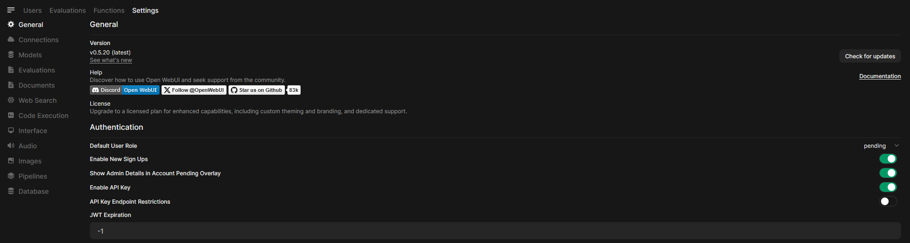
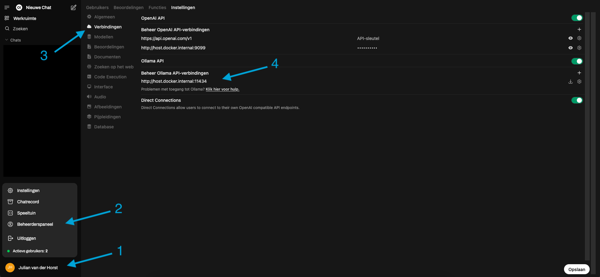
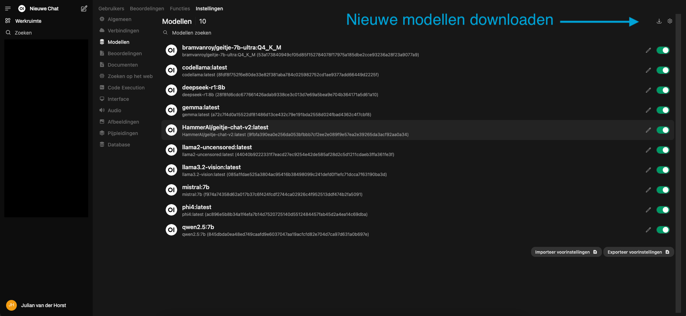

# **Beheren van de omgeving**

## **Eerste keer toegang**

### **Gebruikersbeheer**

De eerste gebruiker die zich registreert krijgt automatisch beheerrechten. Daarna kunnen de instellingen worden aangepast in het admin panel.



Nieuwe gebruikers kunnen via de admin interface worden toegevoegd. (Mocht je al bestaande gebruikers hebben dan is er, afhankelijk van de situatie, een geavanceerde optie deze te koppelen https://docs.openwebui.com/features/sso/)

### **Connectie maken met ollama**

Wanneer alles is opgestart en je kan inloggen bij openweb ui, dan moeten we alleen nog instellen waar precies ollama draait. 

- Klik op je gebruiker, linksonderin
- Klik op Beheerderspaneel
- Klik op instellingen
- Klik op verbindingen
- Pas dan de ollama API verbinding aan naar: 
```
http://host.docker.internal:11434
```



## **Modellen beheren**

### **Modellen downloaden**

Na inloggen op de Open WebUI interface kun je modellen downloaden en beheren via het "Models" tabblad.



Een aantal interessante modellen om mee te beginnen zijn:

- **bramvanroy/geitje-7b-ultra:Q4_K_M**: Een Nederlands model
- **deepseek-r1:8b**: Een krachtig Chinees reasoning-model, interessant is om te zien dat een lokaal model echt andere dingen zegt over bijvoorbeeld Taiwan dan de versie die als dienst wordt aangeboden
- **gemma:7b**: Een compact model van Google
- **phi4:latest**: Microsofts model
- **qwen:7b**: Een veelzijdig model van Alibaba
- **mistral:7b** Een model uit Frankrijk
- **llama2-uncensored:latest** Een ongecensureerde versie van LLAMA, deze is interessant omdat je hiermee kan zien welke verschillen er zijn tussen een lokale variant en een commerciële variant waar de ruwe randjes van zijn afgeschuurd

**Modellen downloaden via terminal** Als alternatief kun je modellen ook downloaden via de commandline:

1. Verbinding maken met de Ollama container
```bash
docker exec -it ollama bash
```

2. Model downloaden (voorbeeld: Deepseek-r1:14b)
```bash
ollama pull deepseek-r1:14b
```

3. Lijst van geïnstalleerde modellen bekijken
```bash
ollama list
```

### **Modelbeperkingen en prestaties**

Met de RTX 4070 Super (12GB VRAM) kun je werken met modellen tot ongeveer 14 miljard parameters. Grotere modellen zoals Llama 3 70B of Deepseek-r1:32b passen niet in het geheugen van deze GPU.

Je kunt het volgende commando gebruiken om het huidige GPU-geheugengebruik te controleren:

```bash
nvidia-smi
```

### **Modelinstellingen aanpassen**

Open WebUI biedt verschillende instellingen om het gedrag van modellen aan te passen, een paar interessante zijn:

- **Temperature** (0.0-2.0): Bepaalt creativiteit/willekeurigheid. Lagere waarden (0.0-0.3) geven meer deterministische, consistente antwoorden, hogere waarden (0.7-1.0) geven meer creatieve, gevarieerde antwoorden.
- **Top P** (0.0-1.0): Controleert diversiteit. Lagere waarden beperken de woordkeuze tot meer waarschijnlijke opties.
- **Context Length**: Maximum aantal tokens dat het model kan verwerken, inclusief invoer en gegenereerde tekst.

Pas deze instellingen aan om te experimenteren.

### **Interessante opties**

Open WebUI biedt een aantal andere interessante opties:

- **API endpoints** https://docs.openwebui.com/getting-started/api-endpoints/ als je niet de interface wil gebruiken maar een model programmatisch wil benaderen is er een optie voor een HTTP API.
- **System prompts** https://docs.openwebui.com/features/chat-features/chat-params/#system-prompt-and-advanced-parameters-hierarchy-chart hiermee kan je specifieke instructie aan een model geven hoe deze zich tijden een chat moet gedragen.
- **Filter functions** https://docs.openwebui.com/features/plugin/functions/filter/ hiermee kan je programmatisch inkomende chatberichten en LLM antwoorden aanpassen.

## Beheer

### **Lokale netwerktoegang**

Om de interface beschikbaar te maken op je lokale netwerk, wijzig je de poortbinding in docker-compose.yml:
```yaml
ports:
  - "0.0.0.0:3000:8080" # 0.0.0.0 betekend beschikbaar op alle netwerkinterfaces
```

De interface is dan bereikbaar via http://[server-ip]:3000 op je lokale netwerk.

### **Externe toegang**

Externe toegang is zeer afhankelijk van de netwerk opzet waarin de PC draait en dit zal afhangen van de organisatie. Er zijn hier veel mogelijkheden voor. Een aantal dingen om rekening mee te houden zijn DNS, als je wil dat externe toegang via een URL mogelijk is. TLS voorzieningen zodat de toegang via een veilige verbinding kan verlopen, vaak wordt hiervoor een reverse proxy zoals apache, nginx of caddy gebruikt (al dan niet in combinatie met letsencrypt). Houdt er rekening mee dat als het extern toegankelijk is het dan ook voor iedereen toegankelijk is (zelfs al kan niet iedereen inloggen). Zelf gebruiken we op het moment [cloudflare tunnel](https://developers.cloudflare.com/cloudflare-one/connections/connect-networks/).

### **Automatische updates met Watchtower**

Om ervoor te zorgen dat je containers automatisch worden bijgewerkt gebruiken we watchtower, deze wordt meegedeployed in de [docker-compose.yml](docker-compose.yml).

## **Probleemoplossing**

### **Veelvoorkomende problemen en oplossingen**

#### **GPU niet herkend in container**

**Symptoom**: nvidia-smi werkt buiten Docker, maar niet binnen de container.

**Oplossing**:

1. Controleer of nvidia-container-toolkit correct is geïnstalleerd
```bash
sudo apt install nvidia-container-toolkit -y
```

2. Herstart Docker en de containers
```bash
sudo systemctl restart docker
docker-compose down
docker-compose up -d
```

#### **Ollama verliest GPU-verbinding**

**Symptoom**: Modellen werken plotseling veel trager.

**Oplossing**:

1. Herstart alleen de Ollama container
```bash
docker-compose restart ollama
```

2. Controleer logs voor mogelijke oorzaken
```bash
docker-compose logs -f ollama
```

#### **Open WebUI niet bereikbaar**

**Symptoom**: Je kunt de webinterface niet bereiken op localhost:3000.

**Oplossing**:

-Controleer of containers draaien
```bash
docker-compose ps
```
-Controleer logs voor fouten
```bash
docker-compose logs ollama-webui
```
-Controleer of poort 3000 niet door een andere service wordt gebruikt
```bash
sudo lsof -i :3000
```

#### **Modellen laden zeer traag**

**Symptoom**: Het duurt minuten voordat een model wordt geladen.

**Oplossing**:

1. Pas de OLLAMA_KEEP_ALIVE waarde aan in `docker-compose.yml`: `environment: - OLLAMA_KEEP_ALIVE=5m # Houdt model 5 minuten in geheugen`
2. Gebruik kleinere modellen als je GPU-geheugen beperkt is.
3. Controleer of andere processen GPU-geheugen gebruiken met nvidia-smi.

### **Logs interpreteren**

Open WebUI en Ollama genereren logs die nuttig zijn voor probleemoplossing:

Bekijk de laatste 100 logregels van Ollama
```bash
docker-compose logs --tail=100 ollama
```

Volg de logs live (Ctrl+C om te stoppen)
```bash
docker-compose logs -f ollama-webui
```

Veelvoorkomende foutmeldingen:

- CUDA error: out of memory: Je GPU heeft onvoldoende geheugen voor het gekozen model.
- connection refused: Er is een probleem met de verbinding tussen Open WebUI en Ollama.
- failed to pull model: Probleem met het downloaden van een model, meestal een netwerkprobleem.