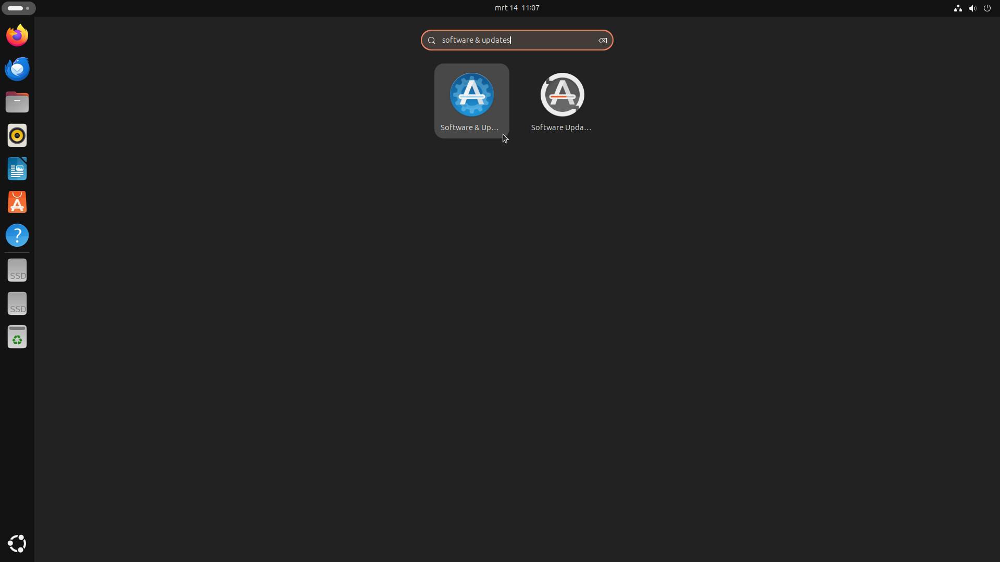
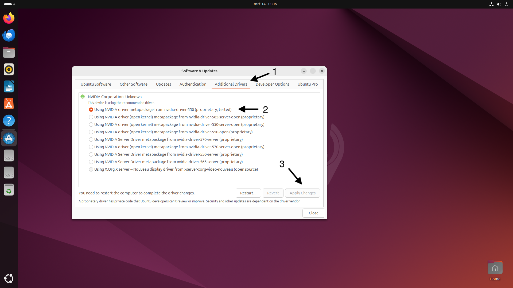

# **Software installatie**

### **Besturingssysteem**

We gebruiken Ubuntu als besturingssysteem vanwege de goede ondersteuning voor Docker en omdat er online uitgebreide technische documentatie voor te vinden is.

1. Download Ubuntu 24.04 LTS van de [officiële website](https://ubuntu.com/download/desktop)
2. Maak een bootable USB-stick met [Rufus](https://rufus.ie/) (Windows) of [Etcher](https://www.balena.io/etcher/) (macOS/Linux)
3. Installeer Ubuntu op je computer volgens de installatiewizard
   
   a. Kies voor "Install third-party software for graphics and Wi-Fi hardware" zodat je de juiste nvidea drivers installeerd.
   b. Optioneel: Kies voor "Encrypt the new Ubuntu installation" voor extra beveiliging (let op: dit kan remote beheer bemoeilijken, omdat er bij het opstarten een wachtwoord moet worden ingevuld om de harddrive te decrypten)

In dit artikel staan verschillende commando's, deze moeten worden uitgevoerd in de terminal. Met "CTRL" + "ALT" + "T." kan je een terminal openen of zoek naar de terminal tussen je applicaties.

### **NVIDIA Drivers installeren**

Om de GPU te kunnen gebruiken moeten NVIDIA-drivers worden geïnstalleerd:

1. Update pakketbronnen
```bash
sudo apt update
sudo apt upgrade -y
``` 
2. Installeer NVIDIA-drivers
Klik op de SUPER toets (windows toets) en typ in:
`Software & updates`



Klik op het tab `Additional Drivers` en selecteer de nieuwste (Momenteel nvidia-driver-550) proriertary tested driver. (Als deze al is geselecteerd hoef je niks te doen).



3. Herstart het systeem
```bash
sudo reboot
```

Controleer na het opstarten of de GPU wordt herkend:

```bash
nvidia-smi
```

Dit commando toont informatie over je GPU, inclusief het huidige gebruik. Je zou een uitvoer moeten zien die lijkt op:
```
+-----------------------------------------------------------------------------+
| NVIDIA-SMI 535.129.03   Driver Version: 535.129.03   CUDA Version: 12.2     |
|-------------------------------+----------------------+----------------------+
| GPU  Name        Persistence-M| Bus-Id        Disp.A | Volatile Uncorr. ECC |
| Fan  Temp  Perf  Pwr:Usage/Cap|         Memory-Usage | GPU-Util  Compute M. |
|                               |                      |               MIG M. |
|===============================+======================+======================|
|   0  NVIDIA GeForce ...  Off  | 00000000:01:00.0  On |                  N/A |
| 35%   45C    P8    21W / 200W |    234MiB / 12288MiB |      0%      Default |
|                               |                      |                  N/A |
+-------------------------------+----------------------+----------------------+
```
